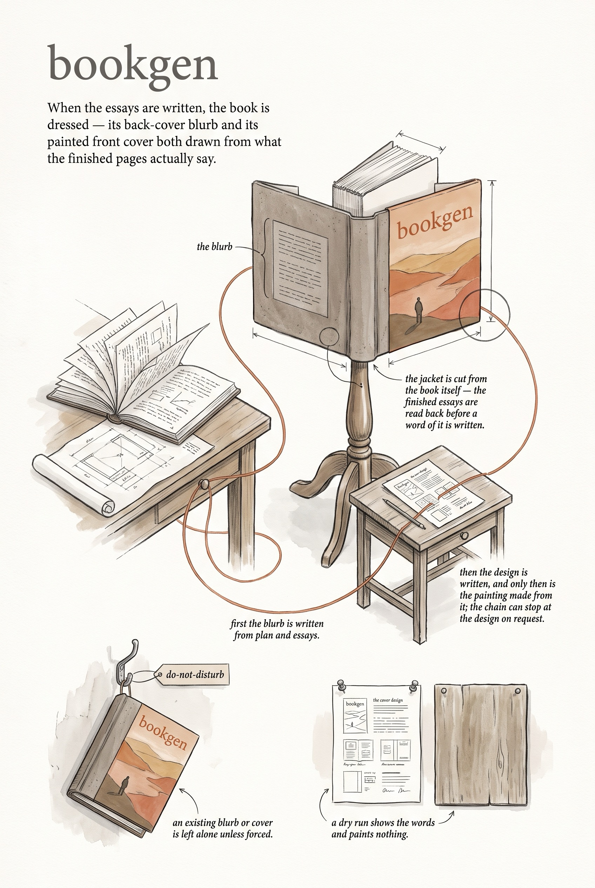

<!-- category: Bookmill -->

# bookgen

Generate a finished book's jacket: the back-cover blurb and the front-cover
prompt and image, from the project's own essays.

## Usage

```bash
bookgen blurb projects/math-books
bookgen cover projects/math-books --title "The Hidden Mathematics"
```

bookgen runs after the mill has written the book. Both subcommands read the
project's Plan and its finished `draft2` essays, so the jacket is drawn from
what the book actually says, not from what it was meant to say.

- **blurb** — writes `book/back-cover-blurb.md` from the plan and the full
  essays via the Anthropic API. If the blurb exists it does nothing;
  `--force` regenerates.
- **cover** — a two-step chain: the text model turns plan, blurb, and essay
  excerpts into a cover design document (`book/front-cover-prompt.md`), and
  the image API paints `book/front-cover.png` from it. `--prompt-only` stops
  after the design; `--title` overrides the title otherwise pulled from the
  Plan's heading; `--author` sets the byline.

Both take `--dry-run` (print the prompt, spend nothing), `--spend cheap|pro` (the registry's compose model and effort at that tier; default cheap), and `--model` (names another model; overrides `--spend`).

## Options

Run `bookgen <command> --help` for command flags:

```
bookgen dev
Generate book artifacts (back-cover blurb, front-cover image) from a project's draft2 essays.

Usage:
  bookgen <command> [flags]

Commands:
  blurb  Generate back-cover blurb
  cover  Generate front-cover prompt + image
```

blurb: `--config`, `--spend`, `--model`, `--dry-run`, `--force`
cover: `--config`, `--spend`, `--model`, `--image-model` (the drawer; default the image model at `--spend`; the cover is always saved as `front-cover.png`), `--dry-run`, `--prompt-only`, `--force`, `--title`, `--author`

## Example

```bash
bookgen blurb projects/mystery --dry-run
```

## Infographic


