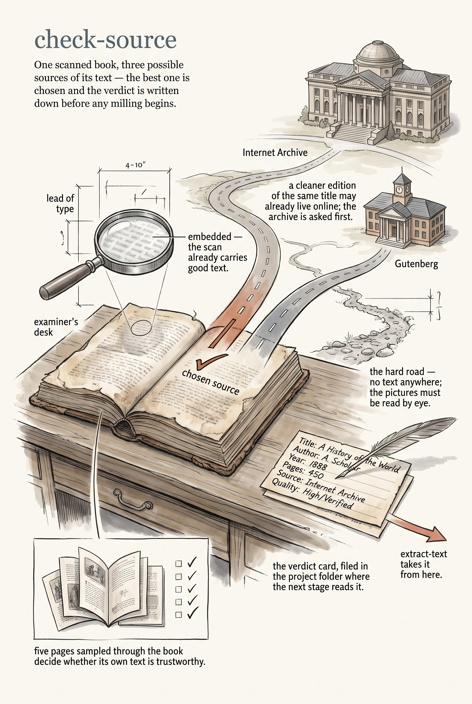

<!-- category: Bookmill -->

# check-source

Decide where one historical PDF's text should come from and record the verdict
in a `.meta.yaml` file.

## Usage

```bash
check-source --pdf "1878 - Campbell - A Sylvan City.pdf" --project-dir projects/books/sylvan-city
```

Where `inventory` surveys the whole shelf, check-source examines a single book
and commits its finding to disk as the first stage file of a pipeline project.
It parses the `YYYY - Author - Title.pdf` filename, counts pages, samples up to
five pages of embedded text for coherence, and — unless `--skip-online` — asks
the Internet Archive and then Project Gutenberg whether a cleaner edition of
the same title exists.

The verdict is a `source_type`: `embedded` when the PDF's own text layer is
good, `archive` or `gutenberg` when an online edition should be fetched
instead, `ocr-needed` when nothing usable exists. Text quality
(`high`/`medium`/`low`/`none`) and a difficulty grade ride along.

With `--project-dir`, the result is written to
`<project-dir>/check-source/.meta.yaml`, where `extract-text` reads it next.
Without it, the YAML goes to stdout.

## Options

Run `check-source --help` for the full option list:

```
check-source dev
Determine the best text source for a historical PDF and write a .meta.yaml file.

Usage:
  check-source [flags]

Flags:
  --pdf          path to the source PDF file
  --project-dir  project directory for output (default: auto from bookmill/projects/)
  --skip-online  skip online source lookups
  -v, --verbose  enable verbose (debug) logging
  -q, --quiet    suppress info logging (warnings/errors only)
  -h, --help     show this help and exit
      --version  print version and exit
```

## Example

```bash
check-source --pdf book.pdf --skip-online
```

## Infographic


