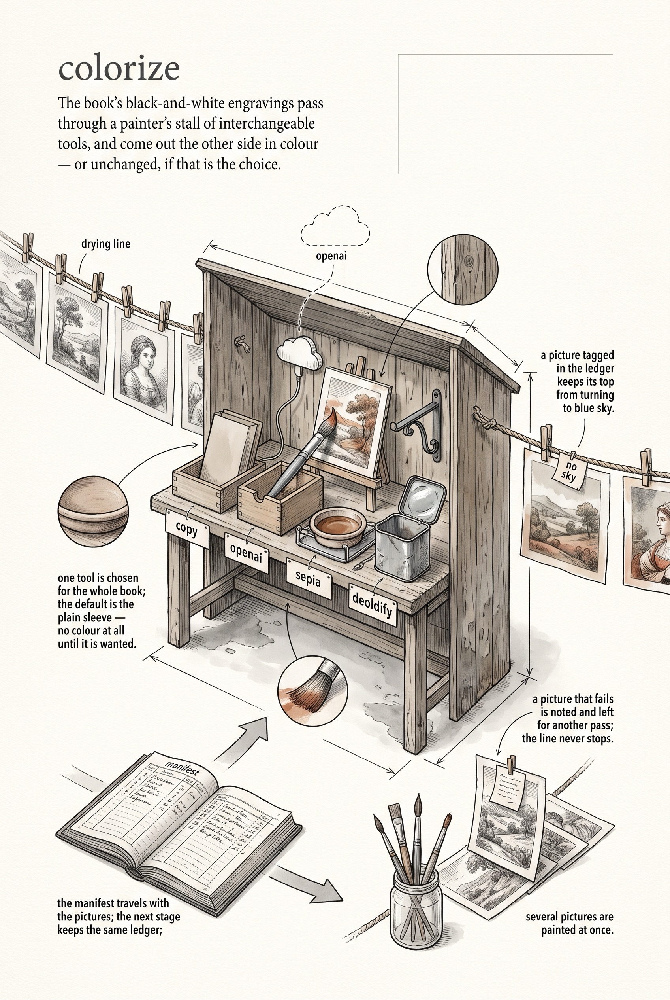

<!-- category: Bookmill -->

# colorize

Colorize the black-and-white images cut from a historical book, driving one of
several colorization tools over the whole manifest.

## Usage

```bash
colorize --input-dir extracted/ --tool openai
```

colorize reads `manifest.yaml` from the input directory — the ledger
`extract-images` wrote — and runs every listed image through the chosen tool:

- `copy` (the default) — no color at all; the originals are copied through, so
  the rest of the pipeline can proceed while color decisions wait.
- `openai` — the image-edit API (`gpt-image-2`) colorizes each engraving using
  the prompt in `prompts/colorize.md`; an image flagged `no_sky` in the
  manifest gets a prompt variant that keeps its top from becoming blue sky.
  Runs `--workers` images in parallel (4 by default). The API key comes from
  the shared credentials store via `packages/creds`.
- `sepia` — a local sepia tone, no API.
- `deoldify` — the DeOldify colorizer, if installed in python3.
- `python-script` — any custom script taking `src dst` arguments, named with
  `--script`.

Output goes to `--output-dir`, or to the manifest's `supporting_dir` when set,
and the manifest is copied alongside so downstream stages keep their ledger.
`--copy-to` mirrors the results to a second directory in the same pass. A
failed image is reported and skipped, never fatal — rerun to fill gaps.

## Options

Run `colorize --help` for the full option list:

```
colorize dev
Colorize B&W images extracted from historical books. Wraps an external colorization tool and copies results to the output directory.

Usage:
  colorize [flags]

Flags:
  --input-dir    directory containing extracted B&W images and manifest.yaml
  --output-dir   override output directory for colorized images
  --copy-to      additional directory to copy colorized images to
  --tool         colorization tool to use: openai, deoldify, python-script, or copy (default: copy)
  --script       path to custom Python colorization script (used with --tool=python-script)
  --prompt       override the default colorization prompt for OpenAI
  --workers      number of concurrent workers for API calls (default: 4)
  -v, --verbose  enable verbose (debug) logging
  -q, --quiet    suppress info logging (warnings/errors only)
  -h, --help     show this help and exit
      --version  print version and exit
```

## Example

```bash
colorize --input-dir extracted/ --tool openai --workers 8 --copy-to composed/images/
```

## Infographic


