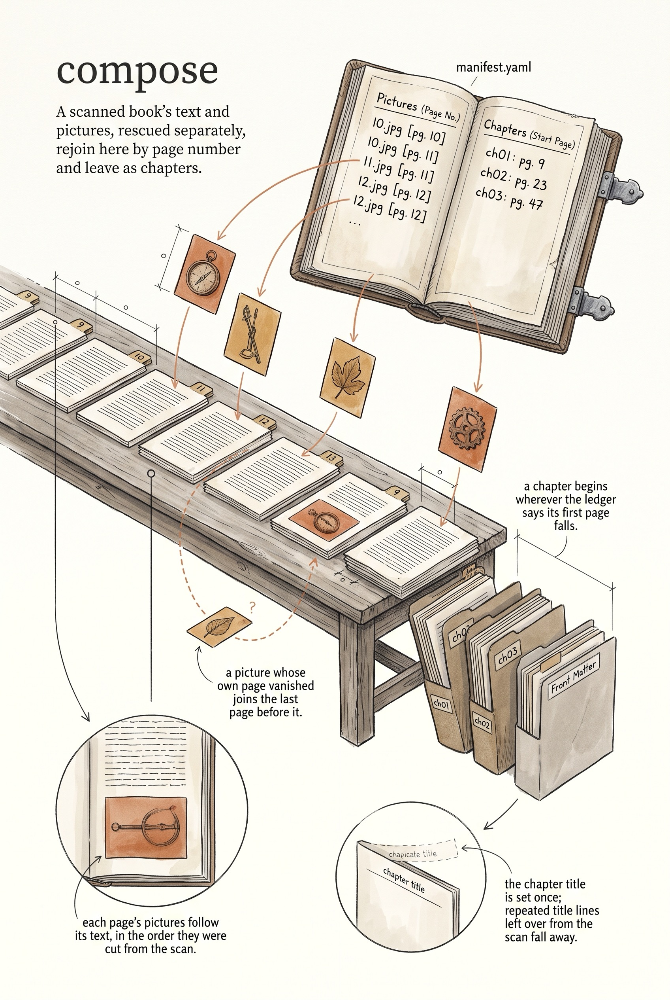

<!-- category: Bookmill -->

# compose

Merge proofed text with the manifest's image markers into final markdown, split
into one file per chapter.

## Usage

```bash
compose --text proofed.md --manifest manifest.yaml --output chapters/
```

compose is the assembly step of the historical-book pipeline: `extract-text`
pulls the raw text, `proof` fixes the OCR, `extract-images` crops the plates,
and compose stitches the results back into a book. It reads the proofed
markdown, which still carries `<!-- page N -->` markers, and the project's
`manifest.yaml`, which lists every extracted image (file, page, sequence) and
every chapter (starting page, title).

For each page of text, compose appends that page's images in sequence order as
`[[IMG:images/<file>|Page N]]` tags — the form `export` and `md2docx` later turn
into real figures. An image whose page produced no text is not dropped: it
attaches after the nearest earlier page that did.

## Splitting

Splitting is on by default. With `--output` naming a directory, compose writes
one markdown file per chapter from the manifest — `ch01 - The Mill Race.md` —
each opened with a `# Title` heading. Old `## ` headings and shouted
ALL-CAPS title lines at a chapter's start are stripped so the heading appears
once. Pages before the first chapter land in `ch00 - Front Matter.md`. Images
referenced by a chapter are copied from `--source-images` into `images/` beside
the chapter files.

With `--split=false`, compose writes a single markdown file (or stdout when
`--output` is omitted). `--keep-page-markers` preserves the `<!-- page N -->`
comments in either mode.

## Options

Run `compose --help` for the full option list:

```
compose dev
Compose final markdown by merging proofed text with image markers from the manifest. Splits into chapters using page boundaries from manifest.

Usage:
  compose [flags]

Flags:
  --text               path to proofed markdown file
  --manifest           path to manifest.yaml (required)
  --output             output directory for chapter files (with --split) or single file
  --image-dir          subdirectory name for image references (default: images)
  --source-images      directory containing extracted images to copy into output
  --keep-page-markers  keep <!-- page N --> markers in output
  --split              split output into one .md per chapter using manifest chapters
  -v, --verbose        enable verbose (debug) logging
  -q, --quiet          suppress info logging (warnings/errors only)
  -h, --help           show this help and exit
      --version        print version and exit
```

## Example

```bash
compose --text proofed/book.md --manifest manifest.yaml \
  --source-images extracted/ --output composed/
```

## Infographic


