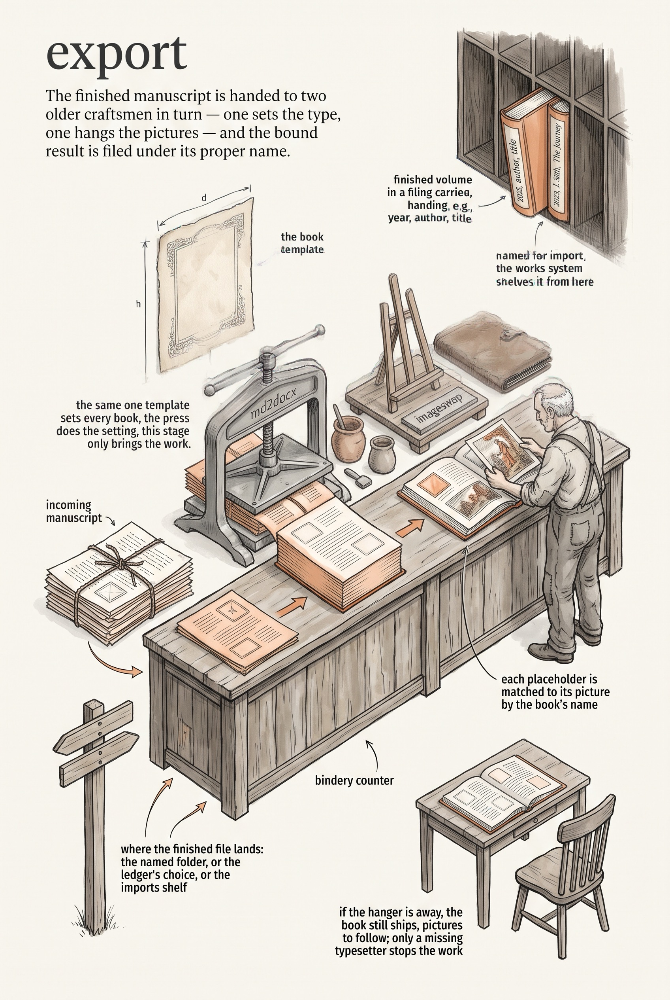

<!-- category: Bookmill -->

# export

Turn composed markdown into the finished `.docx`, images in place, named and
placed for import into the works system.

## Usage

```bash
export --input composed/book.md --manifest manifest.yaml --image-dir colorized/
```

export is the last stage of the historical-book pipeline, and it delegates to
the works tools rather than reinventing them:

1. **md2docx** sets the markdown into a styled `.docx` using the one book
   template (`book-template.dotm` from the works data folder, or
   `--template`).
2. **imageswap** replaces the document's image placeholders with the colorized
   images from `--image-dir`, keyed by `--slug` (derived from the filename
   when not given). `--skip-imageswap` leaves the placeholders.

The output lands in `--output-dir`, else the manifest's `output_dir`, else
`works/imports/files/`, named for import: a `book-file` matching
`YYYY - Author - Title.pdf` becomes `cEssay - YYYY - Author - Title.docx`.
A missing imageswap is a warning, not a failure; a missing md2docx stops the
run.

## Options

Run `export --help` for the full option list:

```
export dev
Export composed markdown to .docx using md2docx and imageswap. Produces the final book file for import into the works system.

Usage:
  export [flags]

Flags:
  --input           path to composed markdown file
  --manifest        path to manifest.yaml (output_dir read from here)
  --output-dir      override output directory for .docx file
  --template        path to .dotm template
  --image-dir       directory containing colorized images for imageswap
  --slug            override imageswap slug (default: derived from docx filename)
  --book-file       original PDF filename (for naming the output)
  --skip-imageswap  skip imageswap step
  -v, --verbose     enable verbose (debug) logging
  -q, --quiet       suppress info logging (warnings/errors only)
  -h, --help        show this help and exit
      --version     print version and exit
```

## Example

```bash
export --input composed/book.md --book-file "1878 - Campbell - A Sylvan City.pdf" --image-dir colorized/
```

## Infographic


