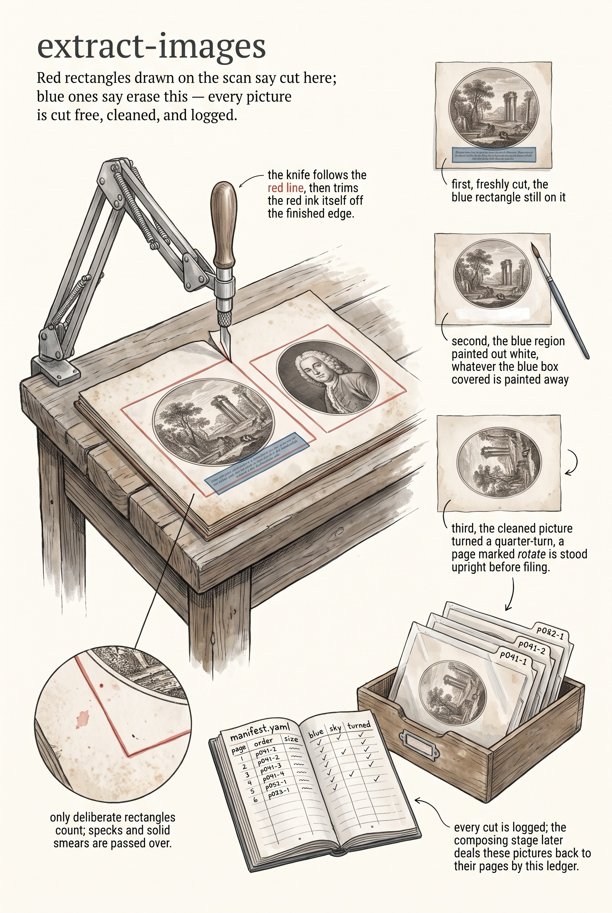

<!-- category: Bookmill -->

# extract-images

Cut the pictures out of an annotated PDF's pages, guided by red and blue
rectangles drawn on the scan.

## Usage

```bash
extract-images --pdf annotated-book.pdf --output-dir extracted/
```

The markup is drawn by hand: a **red rectangle** around each picture worth
keeping, a **blue rectangle** over anything inside it that should be erased
(a caption, a bleed-through, a neighbor's edge). extract-images renders each
page at `--dpi` (300 by default), finds the colored rectangles by flood-fill
— ignoring blobs under 50×50 pixels and solid filled areas that aren't
outlines — and merges boxes that touch or nearly touch.

Each red box becomes a cropped PNG named `p041-1.png` (page, then sequence on
the page). The red outline itself is trimmed from the edges, blue regions are
painted white, and pages annotated `rotate` are turned 90° counter-clockwise.
Alongside the images it writes `manifest.yaml`: one entry per image with its
page, sequence, size, and flags (`had_blue`, `no_sky`, `rotated`) — the file
`compose` later merges against the text.

## Updating an existing manifest

```bash
extract-images --pdf book.pdf --manifest manifest.yaml --update-manifests
```

Re-reads the PDF's text annotations and refreshes the manifest's `rotated`
and `no_sky` flags and its `chapters:` list without re-extracting any images
— for when the markup changed after the cutting was done.

## Options

Run `extract-images --help` for the full option list:

```
extract-images dev
Extract images from annotated PDF pages. Detects red rectangles (image regions) and blue rectangles (erase regions), crops and cleans images.

Usage:
  extract-images [flags]

Flags:
  --pdf               path to the annotated PDF file
  --output-dir        directory for extracted images (default: ./extract-images/)
  --manifest          path to manifest.yaml (required with --update-manifests)
  --update-manifests  scan PDF annotations and update manifest, then stop
  --dpi               DPI for rendering PDF pages (default: 300)
  --start-page        start from this page (default: 1)
  --end-page          stop at this page (default: all)
  --red-threshold     minimum red channel value for red detection (default: 180)
  --blue-threshold    minimum blue channel value for blue detection (default: 180)
  -v, --verbose       enable verbose (debug) logging
  -q, --quiet         suppress info logging (warnings/errors only)
  -h, --help          show this help and exit
      --version       print version and exit
```

## Example

```bash
extract-images --pdf book.pdf --start-page 30 --end-page 60 --output-dir extracted/
```

## Infographic


