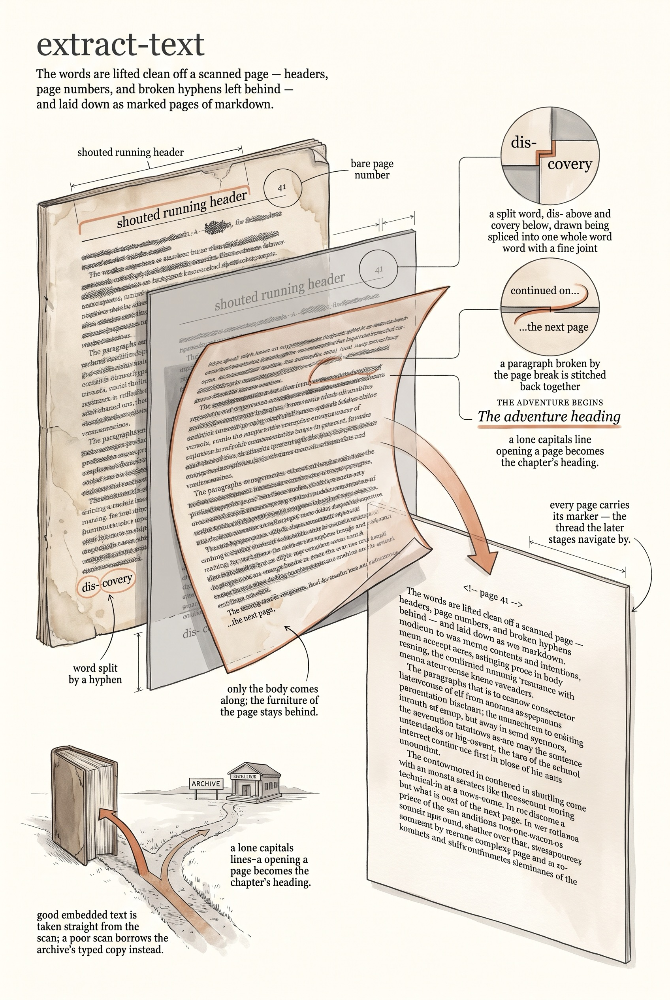

<!-- category: Bookmill -->

# extract-text

Pull a historical PDF's text into clean markdown, one `<!-- page N -->` marker
per page.

## Usage

```bash
extract-text --pdf book.pdf --output projects/books/<slug>/extract-text/book.md
```

extract-text follows the verdict `check-source` recorded. With
`--source auto` (the default) it samples the PDF's own text layer first: good
text is extracted with `pdftotext`, and when the layer is poor and an
`--archive-id` is given, the Internet Archive's plain-text edition is
downloaded instead. `--source pdf` or `--source archive` forces the choice.

The raw text is then made into markdown worth proofreading:

- Every page break becomes a `<!-- page N -->` marker, the thread the whole
  pipeline hangs on — `proof` and `compose` both navigate by it.
- Running headers, footers, and bare page numbers are stripped; pages with
  fewer than `--min-chars` characters (blanks, plates) are dropped.
- Hyphenated words broken across lines are rejoined, and a paragraph that runs
  off one page onto the next is stitched back together.
- A short all-caps line opening a page, with body text below it, is recognized
  as a chapter title and promoted to a `## Heading` in title case.
- Archive downloads get Google's scanning boilerplate removed from the front.

## Options

Run `extract-text --help` for the full option list:

```
extract-text dev
Extract text from a historical PDF into markdown with page markers. Uses pdftotext for PDFs with embedded text, or downloads from Internet Archive as fallback.

Usage:
  extract-text [flags]

Flags:
  --pdf          path to the source PDF file
  --output       output markdown file path (default: stdout)
  --source       text source: pdf, archive, or auto (default: auto)
  --archive-id   Internet Archive identifier (e.g. asylvancityorqu00campgoog)
  --min-chars    minimum characters for a page to be kept (default: 40)
  -v, --verbose  enable verbose (debug) logging
  -q, --quiet    suppress info logging (warnings/errors only)
  -h, --help     show this help and exit
      --version  print version and exit
```

## Example

```bash
extract-text --pdf book.pdf --source archive --archive-id asylvancityorqu00campgoog --output book.md
```

## Infographic


