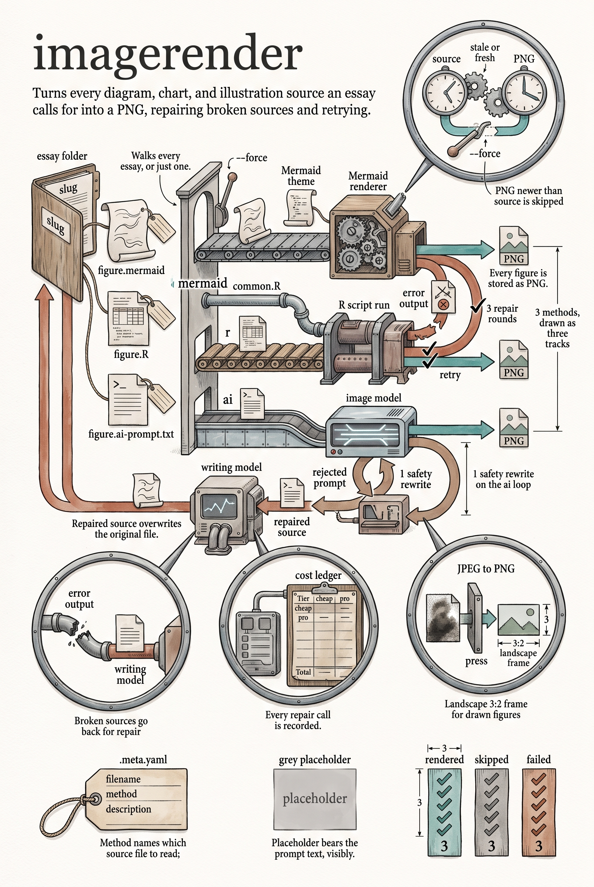

<!-- category: Bookmill -->

# imagerender

Render every image a project's essays call for — Mermaid diagrams, R charts,
and AI illustrations — repairing broken sources as it goes.

## Usage

```bash
imagerender --base-dir projects/math-books --data bookmill/data
```

Each essay's images live in `<base-dir>/images/<slug>/`, one `.meta.yaml` per
image naming the output PNG, the method, and a description. The source sits
beside it, named for the method: `figure.mermaid`, `figure.R`, or
`figure.ai-prompt.txt`. imagerender walks every slug (or just `--slug`) and
renders what's stale — a PNG newer than its source is skipped unless
`--force`.

By method:

- **mermaid** — rendered with `mmdc`, using `mermaid-theme.json` from the
  `--data` directory when present.
- **r** — run through `Rscript`; the script sources the shared `common.R`
  and saves through its `save_chart`.
- **ai** — the prompt file goes to the image model at `--spend` (cheap by default, Gemini Flash Image; `--image-model` names another Gemini or OpenAI model). The figure is always stored as PNG; a JPEG reply is re-encoded.

The mill fixes its own breakage: when a Mermaid or R source fails, the error
output and source go to the writing model at `--spend` (`--text-model` names another, which must be an Anthropic model) for repair — the repaired
source is written back and retried, up to three times. An AI prompt rejected
by the safety filter is rewritten once and retried. If everything fails, a
grey placeholder PNG bearing the prompt text is produced so the book builds
with a visible stand-in rather than a hole. Repair calls land in the shared
cost ledger.

## Options

Run `imagerender --help` for the full option list:

```
imagerender dev
Render images (mermaid / R / DALL-E) referenced by .meta.yaml files in a project's images directory.

Usage:
  imagerender [flags]

Flags:
  --config       path to config.yaml
  --base-dir     project base directory (default: <cwd>/projects/math-books)
  --data         path to data directory containing common.R and mermaid-theme.json
  --slug         render images for a specific essay slug only
  --force        re-render even if PNG exists and is newer than source
  --spend        cheap | pro — the model tier
  --text-model   model that writes (see the ai registry)
  --image-model  model that draws
  -v, --verbose  enable verbose (debug) logging
  -q, --quiet    suppress info logging (warnings/errors only)
  -h, --help     show this help and exit
      --version  print version and exit
```

## Example

```bash
imagerender --slug snap-crackle-and-pop --force
```

## Infographic


