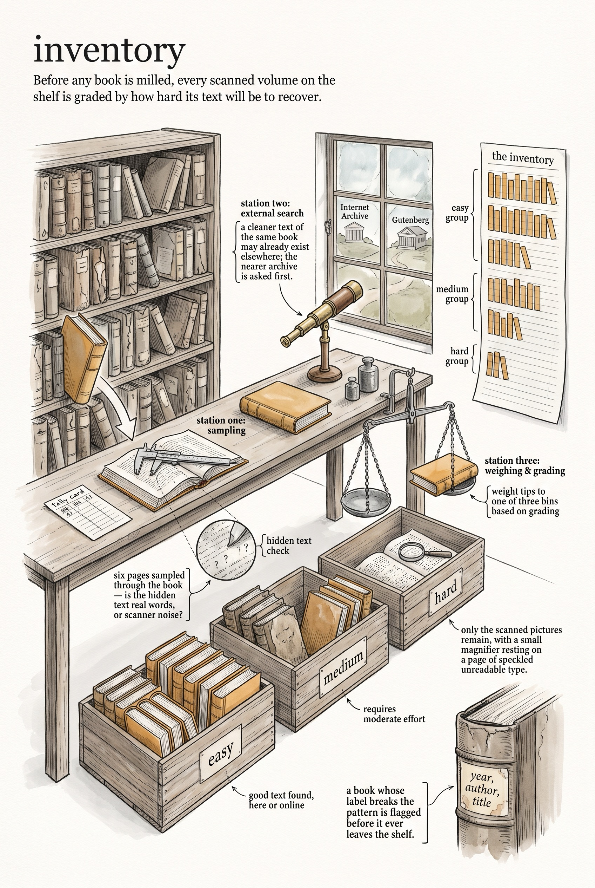

<!-- category: Bookmill -->

# inventory

Scan a folder of historical PDFs and grade each book by how hard its text will
be to recover.

## Usage

```bash
inventory --dir "path/to/Historical Books" --output inventory.yaml
```

inventory is the survey step that comes before any book enters the pipeline.
For every PDF in the folder it:

- **Validates the filename** against the `YYYY - Author - Title.pdf` convention
  and records what's wrong when it doesn't match.
- **Counts pages** with `pdfinfo`.
- **Samples the embedded text** — up to six pages spread through the book, each
  judged for coherence (enough length, mostly letters, real words) — and grades
  it `high`, `medium`, `low`, or `none`.
- **Searches online sources** — the Internet Archive first, Project Gutenberg
  second — for a matching text edition, unless `--skip-online`.
- **Scores difficulty**: `easy` when an online source or high-quality embedded
  text exists, `medium` for middling embedded text, `hard` when OCR is the only
  road.

The result is one YAML (or `--format json`) document listing every book, sorted
easiest first — a worklist for deciding which books to mill next.

## Options

Run `inventory --help` for the full option list:

```
inventory dev
Scan a directory of historical PDFs, validate naming, check for embedded text and online sources, and produce a sorted inventory.

Usage:
  inventory [flags]

Flags:
  --dir          path to the PDF directory to scan
  --output       output file path (default: stdout)
  --format       output format: yaml or json
  --skip-online  skip online source lookups (faster)
  -v, --verbose  enable verbose (debug) logging
  -q, --quiet    suppress info logging (warnings/errors only)
  -h, --help     show this help and exit
      --version  print version and exit
```

## Example

```bash
inventory --dir ../gutenberg/"Historical Books" --skip-online
```

## Infographic


