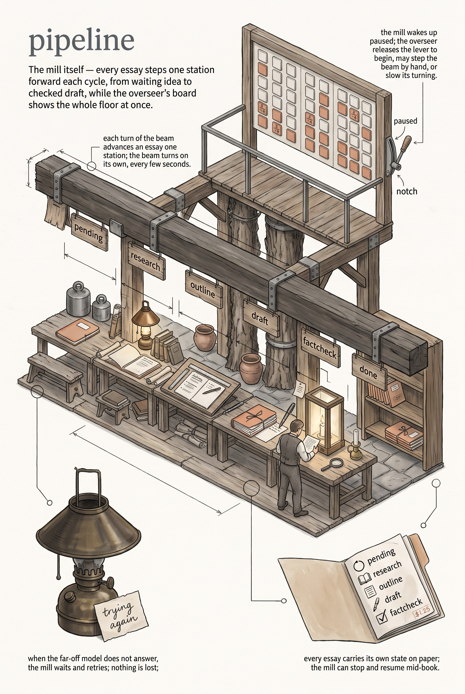

<!-- category: Bookmill -->

# pipeline

Run the essay mill: every idea stub advances research → outline → draft →
factcheck → done, one stage per cycle, watched from a live dashboard.

## Usage

```bash
pipeline --config config.yaml
```

pipeline discovers every project under `projects/`, loads each essay's state
from its `.meta.yaml` (the stubs `scaffold` created start at `pending`), and
then cycles. Each cycle picks up essays and moves them one stage forward
through the model calls; each essay's status, stage files, and accumulated
cost live in its project folder, so the mill can stop and resume at any
point.

The dashboard (a local web page, port from `config.yaml` or `--port`) shows
every essay's stage, the running log, retry status when the API is down, and
the controls: the pipeline **starts paused** — click Resume to begin. From
the dashboard you can also step a cycle immediately or change the cycle
interval (default 15 seconds). Ctrl-C shuts down cleanly, cancelling
in-flight work and printing a final per-project summary with total cost; a
third Ctrl-C force-quits.

`--dry-run` runs the whole machinery without API calls; `--once` runs a
single cycle and exits.

## Options

Run `pipeline --help` for the full option list:

```
pipeline dev
Run the math-books essay pipeline (research → outline → draft → factcheck → done) with a live dashboard.

Usage:
  pipeline [flags]

Flags:
  --config       path to config.yaml
  --dry-run      override config to force dry-run mode
  --once         run a single cycle and exit
  --port         override dashboard port
  -v, --verbose  enable verbose (debug) logging
  -q, --quiet    suppress info logging (warnings/errors only)
  -h, --help     show this help and exit
      --version  print version and exit
```

## Example

```bash
pipeline --dry-run --once
```

## Infographic


