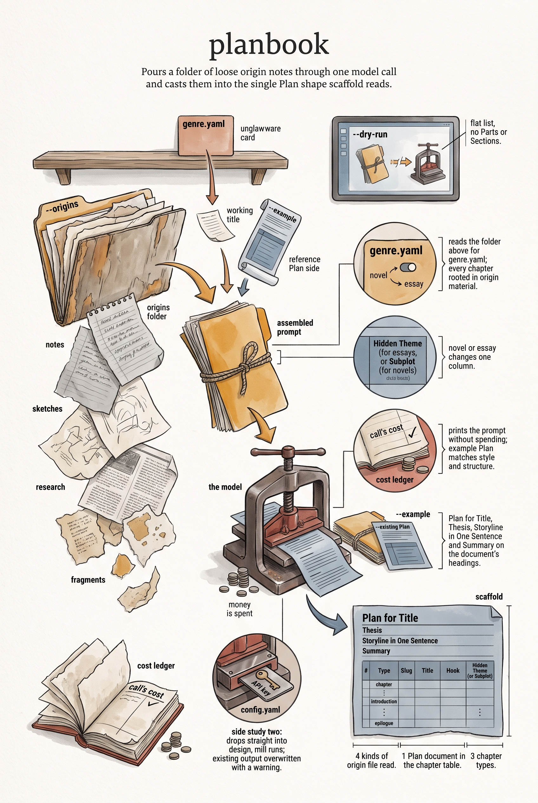

<!-- category: Bookmill -->

# planbook

Generate a book's structured Plan from a folder of origin material, via the
Anthropic API.

## Usage

```bash
planbook --origins design/mystery/origins --title "The Quaker Detective" --output "design/mystery/Plan for Mystery.md"
```

planbook reads everything in the origins folder (`.md`, `.txt`, `.yaml`, `.yml`) —
notes, sketches, research, fragments — plus the series' `genre.yaml` from the
folder above it, and asks the model for a single markdown Plan in the fixed
house shape:

- `# Plan for <Title>`, a `## Thesis`, and `## The Storyline in One Sentence`
- one flat chapter table — `# | Type | Slug | Title | Hook | Hidden Theme`
  (essay books) or `… | Hook | Subplot` (novels) — every row rooted in the
  origin material
- a closing `## Summary` with the chapter count

That table is exactly what `scaffold` parses, so the plan drops straight into
`design/` and the mill runs from it. `--example` supplies an existing Plan as
a format reference; `--dry-run` prints the assembled prompt without spending;
`--text-model` picks the writer (default: the ai registry's pro-tier compose
model). The call is logged to the shared cost ledger. An existing output file
is overwritten with a warning.

## Options

Run `planbook --help` for the full option list:

```
planbook dev
Generate a structured book Plan from origin material via the Anthropic API.

Usage:
  planbook [flags]

Flags:
  --origins      path to the origins folder (required)
  --example      path to an existing Plan file to use as format reference
  --output       output file path (default: stdout)
  --title        working title for the book
  --dry-run      print the prompt without calling the API
  --text-model   model that writes (see the ai registry)
  --config       path to config.yaml for API key
  -v, --verbose  enable verbose (debug) logging
  -q, --quiet    suppress info logging (warnings/errors only)
  -h, --help     show this help and exit
      --version  print version and exit
```

## Example

```bash
planbook --origins design/extra-dwarfs/origins --dry-run
```

## Infographic


