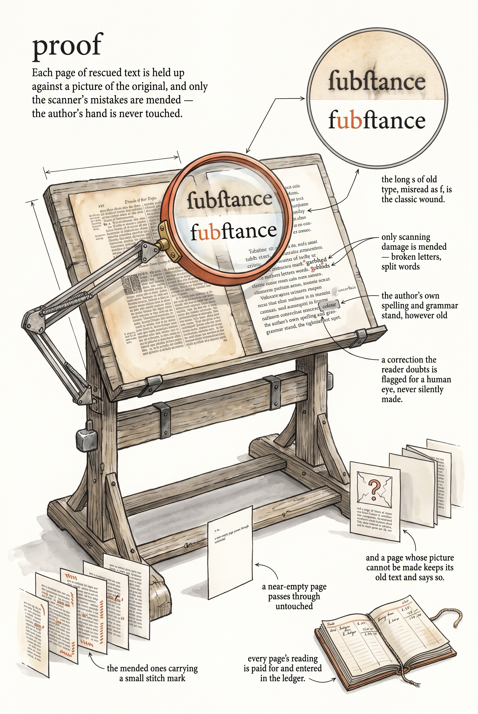

<!-- category: Bookmill -->

# proof

Proofread extracted text page by page against pictures of the original,
using a vision model.

## Usage

```bash
proof --input extracted.md --pdf book.pdf --output proofed.md
```

proof takes the markdown that `extract-text` produced and the original PDF,
and checks every page's words against the page itself. For each
`<!-- page N -->` block it renders that page of the PDF to an image with
`pdftoppm`, then sends text and image together to a vision model (`gpt-4o` by
default, `--text-model` to choose another) with strict orders:

- **Fix only scanning damage** — garbled characters, wrong letters, broken
  ligatures, the long-s (ſ) misread as f, words broken at line ends.
- **Change nothing the author wrote** — original spelling (colour, connexion),
  archaic grammar, punctuation, and capitalization all stand.
- **Confess uncertainty** — a doubtful correction is wrapped in an
  `<!-- uncertain: old → new -->` comment for a human to judge.

Pages shorter than 40 characters pass through untouched, as does any page
whose image fails to render or whose API call errors — a warning is printed
and the original text is kept. `--start-page`/`--end-page` limit the run,
`--dry-run` lists what would be proofed without spending. Every call lands in
the shared cost ledger, and the total is printed at the end.

## Options

Run `proof --help` for the full option list:

```
proof dev
Proofread extracted text by comparing against rendered PDF page images using a vision model. Fixes OCR errors while preserving original spelling and style.

Usage:
  proof [flags]

Flags:
  --input        path to extracted markdown file (from extract-text)
  --pdf          path to the source PDF file (for rendering page images)
  --output       output proofed markdown file (default: stdout)
  --text-model   model that writes (see the ai registry)
  --dpi          DPI for rendering PDF pages (default: 200)
  --start-page   start proofreading from this page number (default: 1)
  --end-page     stop proofreading at this page number (default: all)
  --dry-run      show what would be proofed without calling the API
  -v, --verbose  enable verbose (debug) logging
  -q, --quiet    suppress info logging (warnings/errors only)
  -h, --help     show this help and exit
      --version  print version and exit
```

## Example

```bash
proof --input book.md --pdf book.pdf --start-page 40 --end-page 60 --output proofed.md
```

## Infographic


