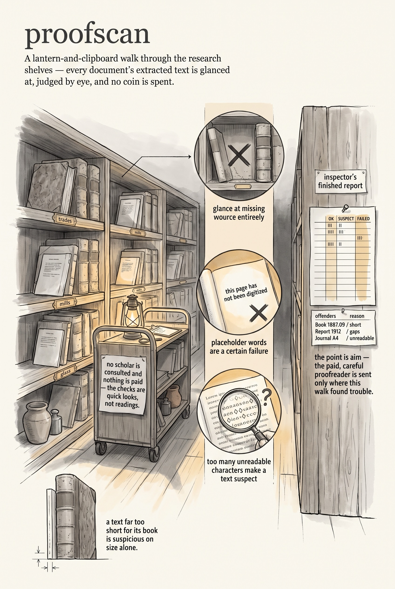

<!-- category: Bookmill -->

# proofscan

Audit the research corpus for broken text conversions — no model, no spend,
just cheap heuristics.

## Usage

```bash
proofscan path/to/corpus
```

Every source document in the corpus (`.pdf`, `.html`) should have a sibling
`.txt` holding its extracted text. proofscan walks the whole tree and judges
each pair without calling any model, so a full scan costs nothing. Verdicts:

- **FAILED** — almost certainly bad: no `.txt` at all, an empty one,
  placeholder text ("has not yet been digitized", "page not found"), more
  than 2% Unicode replacement characters, or under half readable characters.
- **SUSPECT** — worth a look: scattered replacement characters, invalid
  UTF-8, a 50–75% readable ratio, or a file smaller than `--min-bytes`
  (500 by default).
- **OK** — everything else.

The report is a per-shelf summary table (a shelf is a top-level corpus
folder) followed by the FAILED and SUSPECT lists with the reasons that fired,
capped at `--limit` per verdict. `--only-bad` trims the pleasantries. Its
job is targeting: telling the paid, vision-based `proof` pass where to aim.

## Options

Run `proofscan --help` for the full option list:

```
proofscan dev
No-spend audit of the research corpus: flag broken or garbled PDF/HTML-to-text conversions using cheap heuristics.

Usage:
  proofscan [flags] [corpus-dir]

Flags:
  --min-bytes    flag non-empty .txt smaller than this as suspect
  --limit        max offenders to list per verdict (0 = all)
  --only-bad     list only FAILED and SUSPECT files, skip the OK summary detail
  -v, --verbose  enable verbose (debug) logging
  -q, --quiet    suppress info logging (warnings/errors only)
  -h, --help     show this help and exit
      --version  print version and exit
```

## Example

```bash
proofscan ~/research/corpus --only-bad --limit 0
```

## Infographic


