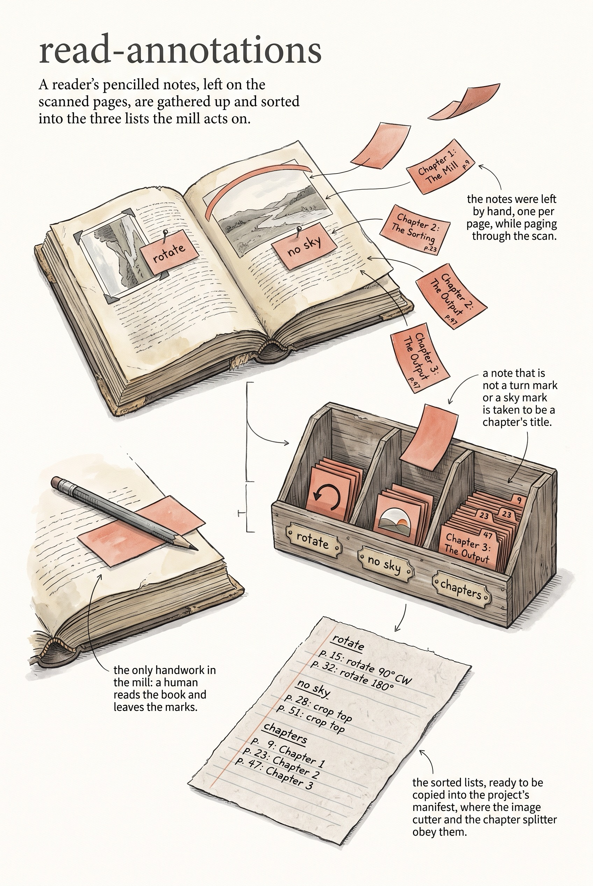

<!-- category: Bookmill -->

# read-annotations

List the hand-written notes left in a marked-up PDF: rotate marks, no-sky
marks, and chapter titles, by page.

## Usage

```bash
read-annotations --pdf annotated-book.pdf
```

Marking up the scanned book is human work: while paging through the PDF, the
author drops text annotations on the pages — `rotate` on an image printed
sideways, `no sky` on a picture whose top must not be cropped as sky, and a
bare title on each page that begins a chapter. read-annotations is how the
rest of the pipeline reads those notes back.

It walks every annotation in the PDF and sorts each into one of three kinds:

- `rotate` — exactly the word "rotate"
- `no_sky` — anything starting with "no sky"
- `chapter` — everything else, treated as a chapter title

Default output is one line per annotation (`page 41  chapter  The Mill
Race`); `--format yaml` groups them into `rotations:`, `no_sky:`, and
`chapters:` lists shaped for pasting into a project's `manifest.yaml`, where
`extract-images` and `compose` act on them.

## Options

Run `read-annotations --help` for the full option list:

```
read-annotations dev
Read text annotations from a PDF and report rotate, no_sky, and chapter title markers by page.

Usage:
  read-annotations [flags]

Flags:
  --pdf          path to the annotated PDF file
  --format       output format: text or yaml (default: text)
  -v, --verbose  enable verbose (debug) logging
  -q, --quiet    suppress info logging (warnings/errors only)
  -h, --help     show this help and exit
      --version  print version and exit
```

## Example

```bash
read-annotations --pdf book.pdf --format yaml
```

## Infographic


