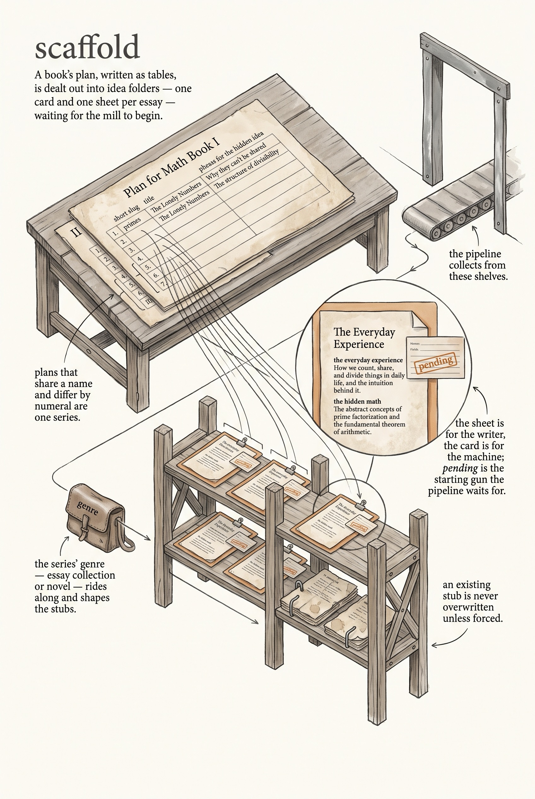

<!-- category: Bookmill -->

# scaffold

Turn design Plan files into one idea stub per essay or chapter —
`.md` + `.meta.yaml` pairs the pipeline will work through.

## Usage

```bash
scaffold --design-dir design
```

scaffold reads every `Plan for <Name>.md` under the design directory. Plans
sharing a base name with Roman-numeral suffixes (`Plan for Math Book I`, `II`,
`III`) group into one series (`math-books`); each series also carries a
`genre.yaml` (essay collection or novel) and optional `attributes.yaml` files
giving per-essay craft attributes (arc, ending, structure, entry, register,
setting, math visibility).

From each plan's tables — one per Part, with columns for number, type, slug,
title, hook, and hidden math — scaffold writes into
`projects/<series>/ideas/`:

- `<slug>.md` — the idea: the hook and the hidden math under headings shaped
  by type (essay, section divider, introduction; scene summary and subplot for
  novels).
- `<slug>.meta.yaml` — the machine card: slug, title, type, series, book,
  part, order, `status: pending`, the drafting model, and the craft
  attributes.

The series' `genre.yaml` is copied into the project folder. Existing stubs
are skipped — `--force` overwrites them. `status: pending` is the starting
gun: the `pipeline` daemon picks these ideas up from here.

## Options

Run `scaffold --help` for the full option list:

```
scaffold dev
Scaffold .md + .meta.yaml stubs in projects/<series>/ideas/ from design Plan files.

Usage:
  scaffold [flags]

Flags:
  --design-dir   design directory containing Plan files
  --force        overwrite existing .md / .meta.yaml stubs
  -v, --verbose  enable verbose (debug) logging
  -q, --quiet    suppress info logging (warnings/errors only)
  -h, --help     show this help and exit
      --version  print version and exit
```

## Example

```bash
scaffold --design-dir design --force
```

## Infographic


